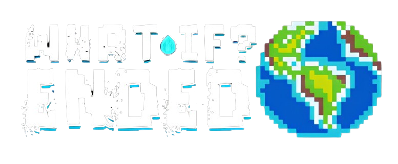

  

 
  * Atenção : Todo o código deste repósitorio foi otimizado para envio, alguns códigos foram removidos da versão final. *

## Tecnologias Utilizadas

## Recursos

- Sistema de Renderização otimizado para Hardware compativeis
- Controle de taxa de frames para melhor desempenho em cada dispositivo
- Resolução adaptvél
- Controle por toque
- Sistema de chuva e iluminação dinâmica
- Sistema de Som Stereo otimizado para fones de ouvido

## Sobre

Bem-vindo à documentação oficial de "What If World Ended". Este jogo tem como objetivo abrir possibilidades para que novas gerações compreendam o impacto do aquecimento global em todo o planeta e explorem soluções para mitigar esses efeitos. "What If World Ended" oferece uma experiência envolvente em pixel-art, com uma direção de arte única e efeitos sonoros otimizados.

## Pesquisa e Conceito

Para este projeto, buscávamos uma abordagem que tivesse impacto global, atraindo tanto usuários experientes quanto iniciantes. Decidimos adotar uma estratégia clara e inclusiva que pudesse cativar todos os públicos. Foi com essa perspectiva que delineamos a direção de "What If World Ended".

A base conceitual do jogo está ancorada na Agenda 2030, um projeto da ONU que visa abordar e resolver questões cruciais até 2030. Dentre os Objetivos de Desenvolvimento Sustentável (ODS), selecionamos o ODS 13, que foca na ação climática. Este objetivo visa mitigar o aquecimento global em larga escala, promovendo a preservação da flora e fauna mundial.

Para criar um jogo que pudesse impressionar e cativar todos os públicos, desejávamos desenvolver algo inovador e visualmente atraente. Nossa ideia foi integrar harmoniosamente jogabilidade, arte e efeitos sonoros, sem perder de vista a importância e o impacto do tema central.

#Direção de Arte

Um jogo que serviu como grande inspiração para este projeto foi o renomado "Dead Cells", criado pela [desenvolvedora]. Admiramos profundamente seu conceito de arte, que utiliza pixel-art e uma iluminação impecável. Inspirados por isso, buscamos na internet assets que pudessem servir como templates iniciais. Otimizamos todas as artes com os efeitos de luz dinâmica nativos da Unity Engine, construindo assim todo o sistema de iluminação para iniciar o desenvolvimento do jogo.

Criamos cenários para testes de desempenho e movimentação. Inicialmente, nossa ideia era desenvolver um jogo cujo personagem fosse um arqueiro, permitindo ao jogador lançar flechas a longa e curta distância. No entanto, devido a restrições de tempo e resultados, decidimos descartar essa ideia e focar em um recurso mais adequado para o projeto.

  

 

## Acompanhe o desenvolvimento desta e outras aplicações em

  

<h1 align="center">
   Desenvolvido por Rhyan Araujo Chaves @2022
</h1>

